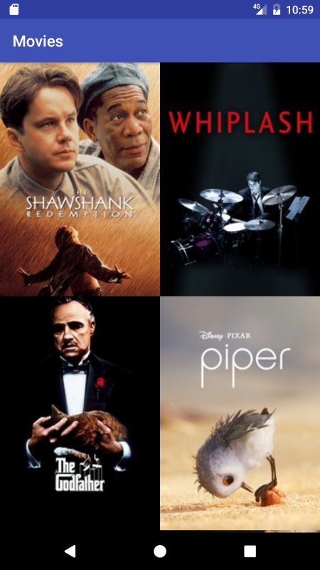

# Movies

It's test project (second one) for Android Nanodegree on a Udacity platform.

# Build

This app uses [the movie db](https://themoviedb.org) and requires
API key to access the data. To accomplish that edit local.properties file
by adding the following line:

````````````````````````````````````````````````````
MOVIES_DB_API_KEY="your_api_key"
`````````````````````````````````````````````````````
Where you_api_key should be replaced with the your API key provided by the moview db.

# Current state


